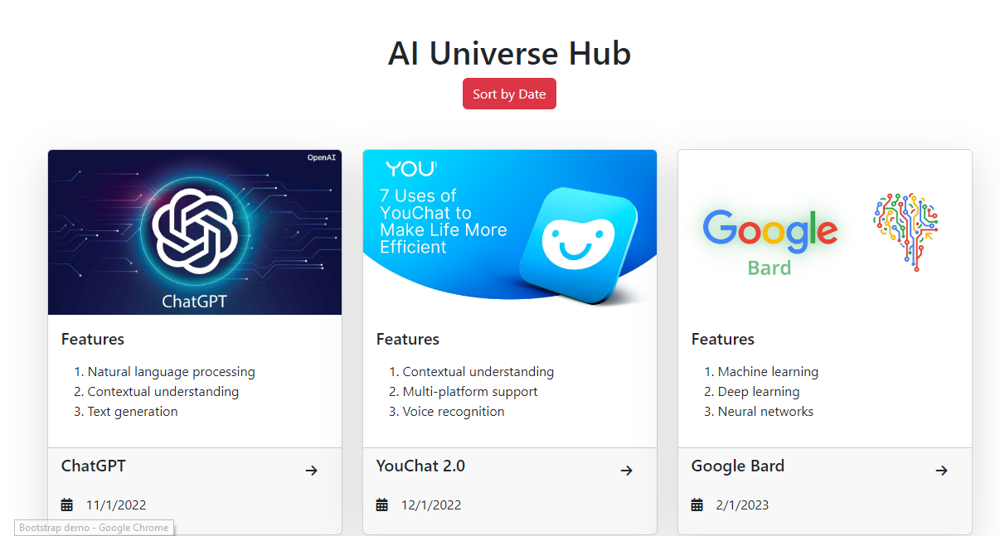
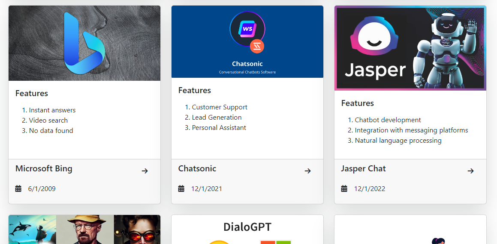
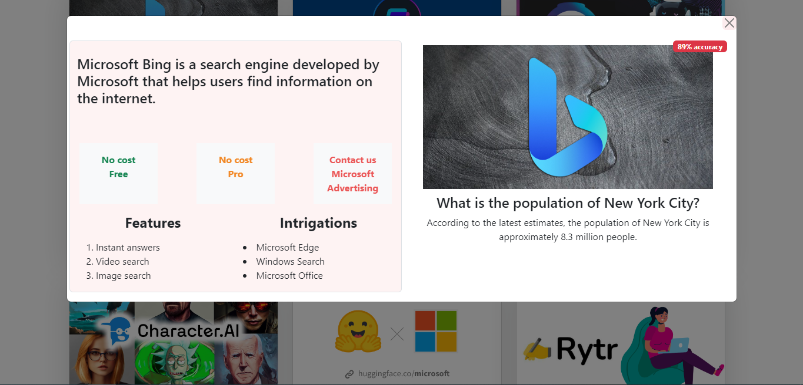

# Netlify Link:
```
https://preeminent-griffin-9291ae.netlify.app/
```

# Github Link:
```
https://github.com/antik1801/AI__All_Hub
```


# AI-universe-hub

### Private Repo Link
Click Here to create [private repo](https://classroom.github.com/a/dhefyS56)

Private Repo link: [https://classroom.github.com/a/dhefyS56](https://classroom.github.com/a/dhefyS56)


## API Links
All data: [https://openapi.programming-hero.com/api/ai/tools](https://openapi.programming-hero.com/api/ai/tools)

Single data details: https://openapi.programming-hero.com/api/ai/tool/${id}

Single data Example: https://openapi.programming-hero.com/api/ai/tool/01




